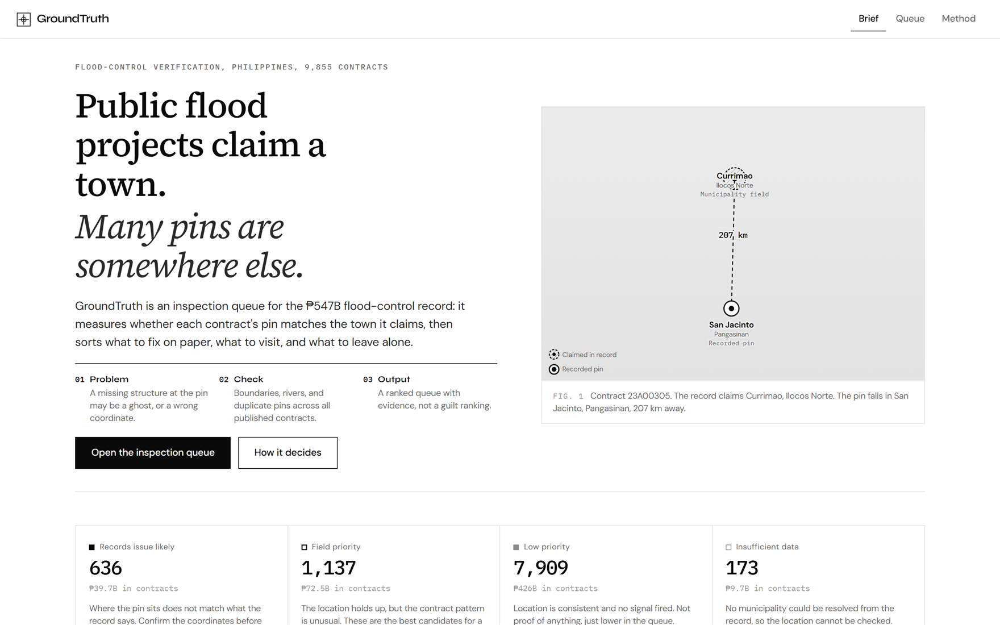
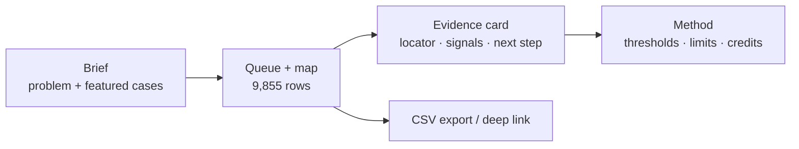
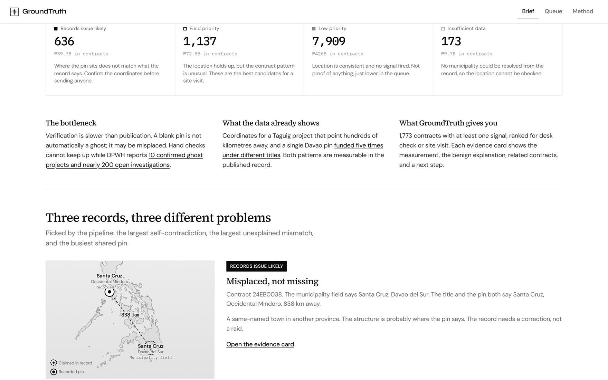
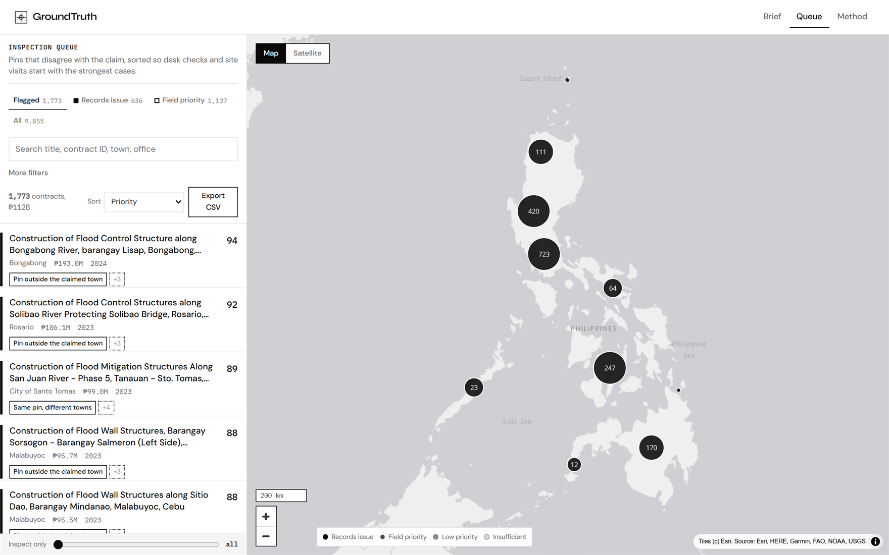
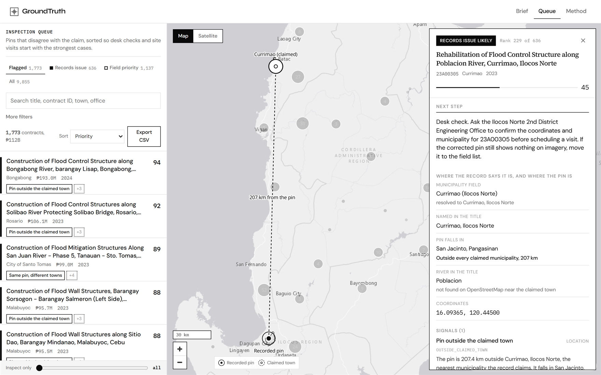
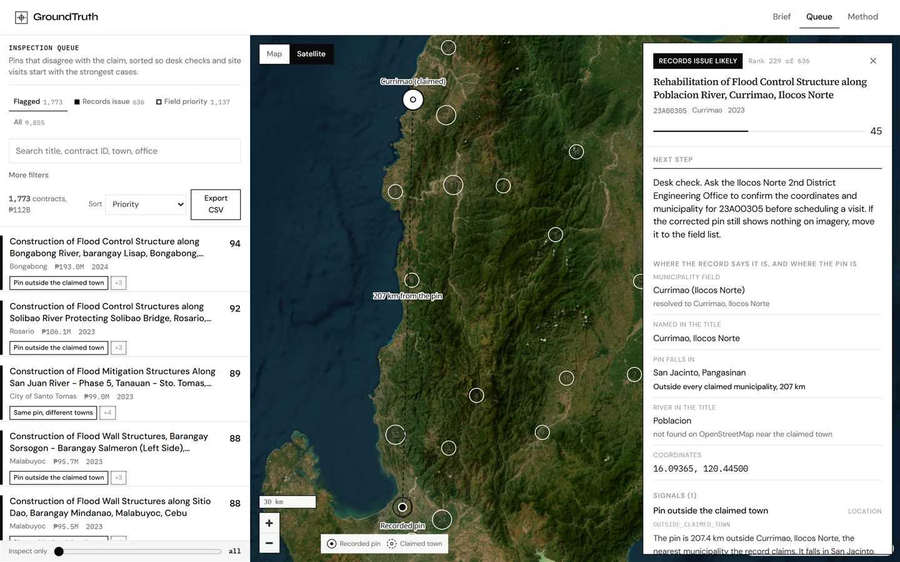
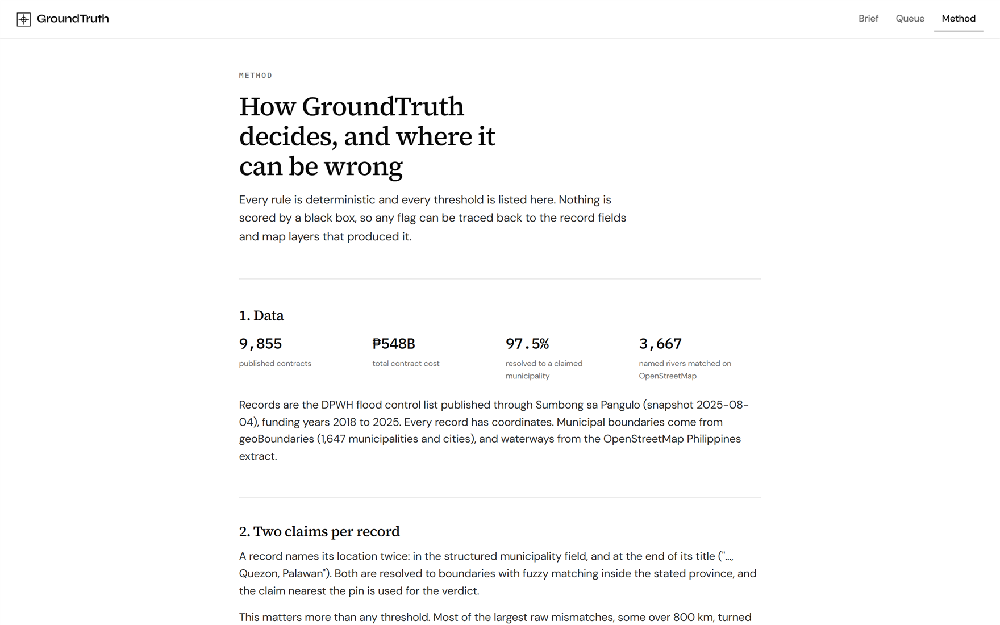

# GroundTruth

**Triage for published Philippine flood control contracts - check the pin against the claimed town, rank what to verify first, and never pretend a flag is a verdict.**

[](https://react.dev/)
[](https://www.typescriptlang.org/)
[](https://vite.dev/)
[](https://maplibre.org/)
[](https://groundtruth-ph.vercel.app/)
[](https://lovhack-season-3.devpost.com/)

**LovHack Season 3** submission (Sep 26 – Oct 4, 2026).

<p align="center">
  
</p>

---

## Overview

The Philippines published **9,855** flood control contracts worth about **₱547.6B**. Verification is the bottleneck. A pin that shows nothing is not automatically a ghost project — it may be misplaced on the map. Existing dashboards flag data. They do not sort *fix the record* from *send someone to the site*.

**GroundTruth** is a static inspection queue that:

1. Resolves **two location claims** per record (municipality field + place named in the title) against municipal boundaries.
2. Runs deterministic checks with named rule codes (`OUTSIDE_CLAIMED_TOWN`, `SHARED_PIN`, …).
3. Labels every row **Records issue likely** · **Field priority** · **Low priority** · **Insufficient data**.
4. Ranks within each label with a 0–100 priority score and an evidence card that shows the measured value **and** a benign explanation.

One of those rows is Contract `23A00305`: the record claims **Currimao, Ilocos Norte**; the pin lands in **San Jacinto, Pangasinan** — **207 km** away. Open it. See the kilometres.

> Check the record. Then check the ground.

---

## Try it now

**Live demo:** [https://groundtruth-ph.vercel.app](https://groundtruth-ph.vercel.app/)

| Surface | URL |
| --- | --- |
| Brief (landing) | [`/`](https://groundtruth-ph.vercel.app/) |
| Inspection queue | [`/#/queue`](https://groundtruth-ph.vercel.app/#/queue) |
| Currimao evidence card | [`/#/queue/947`](https://groundtruth-ph.vercel.app/#/queue/947) |
| Method (rules & limits) | [`/#/method`](https://groundtruth-ph.vercel.app/#/method) |

No login. No backend. All **9,855** scored contracts ship as static JSON.

---

## What makes this different

### 1. Two claims per record, not one pin guess

Each contract names a location twice: the structured municipality field and (often) a place at the end of the title. Both are fuzzy-matched within the stated province. The claim nearest the pin drives the call.

That matters. The largest raw kilometre mismatches are often encoding errors — a same-named town in another province — not missing structures. GroundTruth labels those as **records issues**, not field raids.

### 2. Named rules, measured values, innocent explanations

| Label | Count | Cost | Meaning |
| --- | ---: | ---: | --- |
| Records issue likely | 636 | ₱39.7B | Pin disagrees with the text of the record |
| Field priority | 1,137 | ₱72.5B | Location consistent; risk patterns worth a visit |
| Low priority | 7,909 | ₱426B | Consistent, no signals |
| Insufficient data | 173 | ₱9.7B | Municipality could not be resolved |

Signals include `outside_stated_municipality`, `record_fields_disagree`, `shared_pin`, `consecutive_contracts`, `far_from_named_waterway`, and others — each with strength, measured value, and a benign alternative on the card. Money raises rank; it never creates a flag alone.

### 3. Capacity-aware triage

Keep only the top **N** when inspectors are limited, export the filtered queue as CSV, or share a deep link to one evidence card. Built for journalists, watchdogs, and validators who need a defensible queue — not a guilt machine.

---

## Product surfaces



| Route | Purpose |
| --- | --- |
| `/` | Editorial brief, live label counts, three featured mismatches |
| `/#/queue` | Filterable ranked list + MapLibre map |
| `/#/queue/:id` | Evidence card (pin, claimed outline, waterway, related contracts) |
| `/#/method` | Full rule table, amount-bunching context, licences |

---

## Screenshots

Live product captures from [groundtruth-ph.vercel.app](https://groundtruth-ph.vercel.app/).

### Brief → Queue → Evidence → Method

<table>
<tr>
<td width="50%" valign="top">

<strong>1. Brief</strong><br/>
<br/>
<br/>
<sub>Problem in one breath, live counts, featured cases you can open.</sub>

</td>
<td width="50%" valign="top">

<strong>2. Inspection queue</strong><br/>
<br/>
<sub>1,773 flagged contracts · ₱112B · filter, search, CSV export.</sub>

</td>
</tr>
<tr>
<td width="50%" valign="top">

<strong>3. Evidence card</strong> (Currimao)<br/>
<br/>
<br/>
<sub>Claimed town vs recorded pin, next step, benign explanation.</sub>

</td>
<td width="50%" valign="top">

<strong>4. Method</strong><br/>
<br/>
<sub>Every threshold listed. Nothing scored by a black box.</sub>

</td>
</tr>
</table>

Regenerate screenshots:

```powershell
cd demo
node ../docs/capture-readme-shots.mjs
# optional local: $env:GT_URL="http://127.0.0.1:5173"; node ../docs/capture-readme-shots.mjs
```

---

## Built like a real product, not a slide deck

| Evidence | Detail |
| --- | --- |
| **Full published set** | All **9,855** DPWH flood-control contracts (funding years 2018–2025) |
| **Static deploy** | Vite build on Vercel — no API to fail during judging |
| **Explainable flags** | Named rule codes + measured km / counts + benign copy on every card |
| **Method page** | Thresholds, waterway matching stats, amount-bunching context, credits |
| **Ethics** | Neutral language only; no contractor rankings; disclaimer on every evidence card |

Snapshot source date is stated in-product (Sumbong sa Pangulo / DPWH mirror).

---

## Tech stack

| Layer | From the repo |
| --- | --- |
| Pipeline | Python, pandas, geopandas, shapely, rapidfuzz, pyosmium |
| Web | Vite 8, React 19, TypeScript, MapLibre GL, Motion |
| Data | DPWH via Sumbong sa Pangulo mirror, geoBoundaries ADM3, OpenStreetMap PH, OpenFreeMap |
| Deploy | Vercel (`web/`) — static JSON under `web/public/data/` |

No backend. The UI reads precomputed JSON.

---

## Run it locally

```powershell
git clone https://github.com/yuan05-afk/groundtruth.git
cd groundtruth/web
npm install
npm run dev
```

Open [http://localhost:5173](http://localhost:5173).

### Rebuild scored data (optional)

```powershell
cd pipeline
# place raw inputs under data/raw/ (see PRD.md)
python scripts/build.py
```

Writes into `web/public/data/`.

### Docs in this repo

- [PRD.md](./PRD.md) — product requirements and signal table
- [DEVPOST.md](./DEVPOST.md) — hackathon submission draft
- Method page in the app — full rule table, limits, credits

---

## Ethics

- Neutral copy only (`needs verification` — never `ghost` / `corrupt` in product UI)
- No contractor rankings
- Disclaimer on every evidence card
- Credits BetterGov.ph and Data Dictionary for prior public work on this data

**Licence notes:** OpenStreetMap data requires ODbL attribution. geoBoundaries is CC BY 3.0 IGO. Contract records are government-published data via Sumbong sa Pangulo.

---

## Hackathon fit / what's next

GroundTruth maps to LovHack Season 3: a live public demo, scores backed by evidence, honest **Insufficient data**, and a Method page that states limits.

If we had another week:

1. Fresh portal snapshots on a documented refresh path.
2. Barangay-level boundaries where they exist.
3. Deeper consecutive-run / shared-pin clustering for field teams.
4. Optional imagery overlays that still respect the triage-not-verdict line.

---

_Evidence of outcome: open the [live demo](https://groundtruth-ph.vercel.app/), go to [Queue](https://groundtruth-ph.vercel.app/#/queue), open [Currimao](https://groundtruth-ph.vercel.app/#/queue/947), and read the 207 km line yourself._
